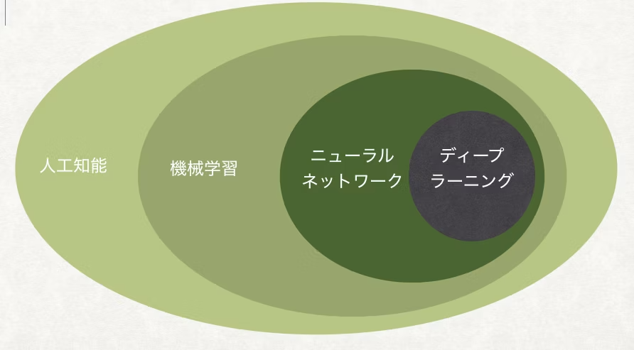
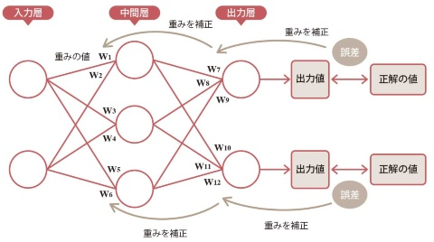
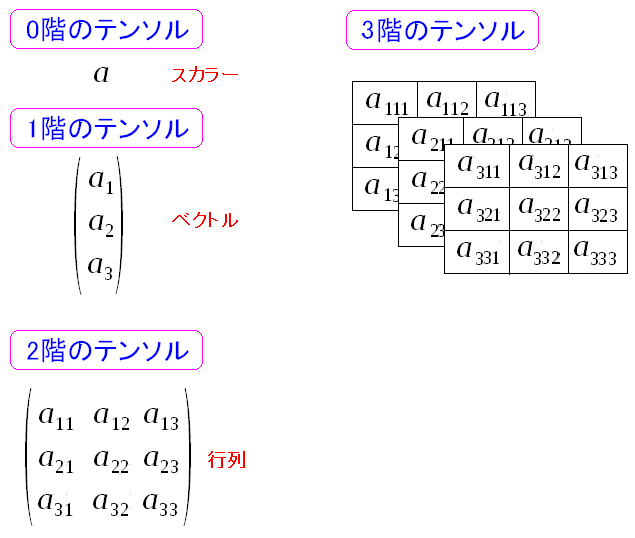
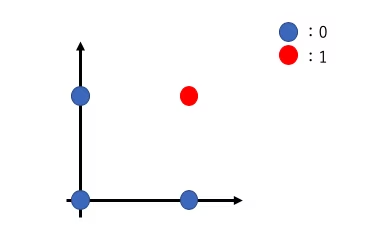
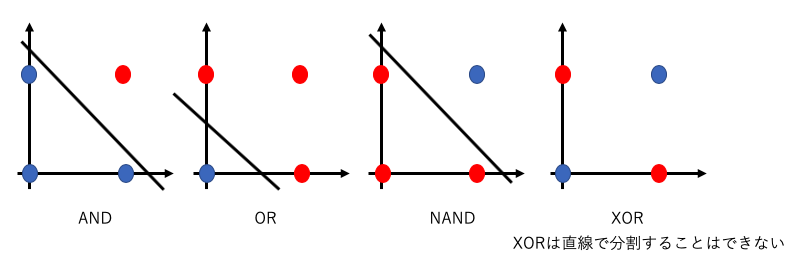

# Python & PyTorch を使った AI プログラミング研修

---

## 概要

ついに、みなさんが **AI（人工知能）プログラミング** の世界に足を踏み入れる時がやってきました。画像認識や文章生成など、あらゆる場面で活用されている **ディープラーニング** は、実は **Python** というプログラミング言語で比較的簡単に試せるようになってきました。本教材では、Python と **PyTorch（パイトーチ）** を使って、ニューラルネットワーク（NN）の基礎から CNN（畳み込みニューラルネットワーク）による画像認識、さらに GAN や拡散モデルなどの生成系 AI までを体験しながら学んでいきます。

この研修では、コンピューター室の **機械学習PC** に **VS Code** を使ってリモート接続し、GPU を活用した高速な学習環境を利用します。はじめに **環境セットアップ** や **Linuxターミナルの基本操作** を確認し、そこから **ディープラーニング** の中核的な仕組みを理解していきます。最終的には、実際にプログラムを書いてデータを学習させ、自分で作った **AIモデル** が推論や画像生成をおこなうところまで体験してみましょう。

「AI は難しそう……」というイメージがあるかもしれませんが、少しずつ手を動かしていけば自然と理解が深まります。まずは、Python と PyTorch の基本や、Linuxのコマンド操作の理解から一緒に始めていきましょう。  
（※上級者向けには、AIがアシストしてくれるエディタ「**Cursor**」の使用もおすすめです。コードの意図やエラーの原因を丁寧に解説してくれます。）

## 研修の流れ
1. **リモート開発環境への接続**や**Ubuntu Lunuxのコマンド操作**を理解する
1. **Python と PyTorch の基本** を押さえ、テンソル操作や NN 構築の流れを理解する（第1部）。  
1. **CNN を用いた画像認識** で、ディープラーニングの具体的な学習・評価を体験する（第2部）。  
1. **生成AI の初歩** GAN や拡散モデルを実装し、新たなデータを“生み出す”楽しさと難しさを実感する（第3部）。

## 到達目標

1. **Python と PyTorch の基本的な使い方**  
   - 仮想環境やライブラリの使い方、VS Code でのリモート接続・操作を一通り体験し、簡単なテンソル演算やニューラルネットワーク構築ができるようになる。

2. **ディープラーニングの基礎理論を理解する**  
   - ニューラルネットワークと誤差逆伝播、活性化関数の役割など、ディープラーニングの基本的な考え方を説明できるようになる。

3. **CNN を用いた画像認識の実践**  
   - MNISTなどの実データを使い、モデルの構築・学習・推論までの一連の流れを体験し、モデル性能の評価やハイパーパラメータの調整を行う。

4. **生成モデルの体験**  
   - GAN（敵対的生成ネットワーク）や拡散モデルなどの簡単な実装を通して、画像などの“新しいデータを生み出す”AIの仕組みを学び、その可能性と応用例をイメージできるようになる。

5. **応用や発展的内容への足がかりを作る**  
   - 他のデータセットや自然言語処理・ロボット制御など、さらに発展したAI分野の学習・研究に取り組むための基礎スキルを身につける。

これから始まる実習を通して、AIプログラミングの面白さとその大きな可能性を実感してもらえたら幸いです。それでは早速、環境セットアップから進めていきましょう。

---


## はじめに：環境セットアップについて

本教材では **Python 3** と **PyTorch(パイトーチ)** を使用します。
実行環境
- WindowsのVisual Studio Code(以下、VS Code)を利用
- コンピューター室の機械学習PCにVS Codeからリモート接続

機械学習PCは以下の環境がインストールされています

- **Python**
- **PyTorch**

AI開発をするにはPythonが有効です。PyTorchをはじめとするAI開発のライブラリが充実しており、GPU(NVIDIAなどが提供する、高速に一括計算できるプロセッサ)を直接使用できるなどパフォーマンス面でのメリットが高いです。

【上級者向け】もっと学びたい人はAIがアシストしてくれるエディタの**Cursor**の使用をおすすめします。実行結果を丁寧に解説してくれるので理解が深まります。

### 接続方法（初回のみ）
1. VS Codeの左下の青アイコンをクリック
1. 画面上部で`SSH`を選択
1. `＋新規SSHホストを追加する...`を選択
1. `ai01@10.3.0.199`と入力
1. 再度、VS Codeの左下の青アイコンをクリック
1. 画面上部で`Connect to Host...`を選択
1. `10.3.0.199`を選択
1. パスワードを入力（別途伝えます）
1. 接続完了

### リモート開発環境のセットアップ方法（初回のみ）
1. メニューからターミナル→新しいターミナルを選択
1. 自分用の作業フォルダを作成。田中さんの場合、ターミナルで `mkdir tanaka` と入力し、エンターキーを押す。
1. 「フォルダーを開く」を押して、自分で作ったフォルダを選択する。
1. 「このフォルダー内のファイルの作成者を信頼しますか？」と表示されるので、`はい、作成者を信頼します`を選択

### 再接続の方法
1. VS Codeの左下の青アイコンをクリック
1. 画面上部で`Connect to Host...`を選択
1. `10.3.0.199`を選択
1. パスワードを入力
1. 接続完了

---

## はじめに：Ubuntu Linux ターミナルの基本的な使いかた

1. **`pwd`** : 自分が今どこにいるかを確認  
2. **`cd` / `cd ..`** : ディレクトリの移動、上の階層に戻る  
3. **`ls`** : ファイル・フォルダの一覧を表示  
4. **`mkdir`** : 新しいディレクトリを作成  
5. **`less`** : テキストファイルをページ単位で読む  
6. **タブ補完** : Tabキーでコマンドやファイル名を自動補完  

これらのコマンドを覚えておくだけでも、Linux ターミナルでの作業がとてもスムーズになります。ぜひ実際に自分の環境で試してみてください。  

### 1. `pwd` - カレントディレクトリ（現在いる場所）の確認

- **意味**: *Print Working Directory* の略。自分が今どのディレクトリ（フォルダ）にいるかを表示してくれる。
- **使い方**: ターミナルに以下のように入力してEnter。
  ```bash
  pwd
  ```
- **例**: 結果として `/home/user` などのパスが表示される。


### 2. `cd` - ディレクトリの移動（Change Directory）

- **意味**: *Change Directory* の略で、ターミナル上で作業するディレクトリを変更するコマンド。
- **基本的な使い方**:
  ```bash
  cd ディレクトリ名
  ```
  - 例：`cd Documents` → 現在のディレクトリの中にある「Documents」ディレクトリへ移動

- **一つ上の階層に戻る**: `cd ..`
  - `cd(半角スペース)..`であることに注意
  - `..` は「一つ上のディレクトリ」を意味する。
  - 例：`cd ..` → 親ディレクトリに移動

- **ホームディレクトリに戻る**: `cd ~` または単に `cd`
  - `~` は自分のユーザーのホームディレクトリを表す。


### 3. `ls` - ディレクトリ内のファイル・フォルダ一覧を表示

- **意味**: *list* の略で、カレントディレクトリにあるファイルやディレクトリの一覧を表示するコマンド。
- **使い方**:
  ```bash
  ls
  ```
- **オプション**:
  - `ls -l` : 詳細な情報（ファイルのパーミッションやサイズなど）をリスト形式で表示
  - `ls -a` : 隠しファイルを含めて全て表示（ファイル名の先頭に「.」がついたもの）


### 4. `mkdir` - ディレクトリの作成 (Make Directory)

- **意味**: *Make Directory* の略で、新しいディレクトリ(フォルダ)を作るコマンド。
- **使い方**:
  ```bash
  mkdir 新しいディレクトリ名
  ```
- **例**:
  ```bash
  mkdir project
  ```
  - 「project」という名前のディレクトリが作成される。


### 5. `less` - テキストファイルの中身をページ単位で見る

- **意味**: ファイルの中身をページ送りしながら閲覧できるコマンド。  
  （`cat` コマンドもあるが、ファイルの内容が長いと一気に流れてしまうので、ゆっくり見るときに `less` が便利。）
- **使い方**:
  ```bash
  less ファイル名
  ```
- **操作方法**:
  - **下にスクロール**: スペースキー や `f` で次ページへ進む
  - **上にスクロール**: `b` で前ページへ戻る
  - **終了**: `q` キーで終了


### 6. タブ補完（Tab キー）

- **意味**: コマンドやディレクトリ名、ファイル名などを途中まで入力した段階で **Tab キー** を押すと、自動で補完（続きの文字）を入力してくれる機能。
- **使い方のコツ**:
  1. コマンドやファイル名を最初の数文字まで入力
  2. キーボードの **Tab キー** を押す
  3. 一意に決まる場合は、自動で残りの文字が補完される
  4. 同じような名前が複数存在する場合は、途中までしか補完されなかったり、二度押しすると候補が一覧表示される

- **例**: 
  1. `cd Dow` と入力して**Tab**キーを押す
  2. ディレクトリに「Downloads」があれば自動で `cd Downloads` に補完される

---
  

# 第1部：ニューラルネットワーク(NN)の基礎

## 本章で理解してほしいこと

1. **ニューラルネットワーク** は何をモデル化したものでしょうか？  
2. **活性化関数** の役割は何でしょうか？  
3. PyTorch における **自動微分 (autograd)** の仕組みを簡単に説明してください。  
4. 簡単な線形回帰モデルを学習する際、**損失関数** として何を用いるのが一般的ですか？  
5. PyTorch でモデルを学習するとき、パラメータの更新処理に必要な関数を 2 つ挙げてください。

## 1.1 機械学習・ディープラーニングの基本概念



### 1.1.1 機械学習とは
学習とは、 **後から与えられた情報をもとに動作が変わる事象** のこと。機械でこの事象を実現しているので **機械学習** と呼ばれる。

機械学習を使うかどうかの違い
- 機械学習を使う人工知能の例：ペットボトルの画像認識
- 機械学習を使わない人工知能の例：エキスパートシステム、運賃計算

**機械学習**: コンピュータが大量のデータをもとにパターンを学習し、未知のデータに対して**推論**を行う技術。
機械学習の例
- モデル作成
  - 教師データ：A→a、B→b、C→c
  - テストデータ：P→p、Q→q、R→r
- 推論
  - Dを入力→dが出力される
  - Eを入力→eが出力される
  - 5を入力→未定義の出力(aやbかもしれない)

機械学習の分類
- **教師あり学習**: 正解ラベルがあるデータを使って学習。例えば画像分類
- **教師なし学習**: 正解ラベルがないデータの構造を学習。例えば歩き方の学習
- **強化学習**: 報酬を最大化するように、評価ルールを定めて学習。


強化学習の例
[【物理エンジン】人工知能にフライパン返しを学習させたら職人になったｗ](https://www.youtube.com/watch?v=DDhv7biBd4o)

### 1.1.2 ディープラーニング（深層学習）とは
- **ディープラーニング**: 多層のニューラルネットワークを用いて複雑なパターンを学習する機械学習の一分野。  
- 特徴抽出から予測まで、すべてを一貫して学習できる点が大きな強み。
- 中間層が2層までが通常のパーセプトロン、3層以上がディープラーニング。
- 2000年頃までは3層以上にしても学習精度が上がらなかったが、 **活性化関数** (後述)などの改善で多層化が進んだ。

古典的なニューラルネットワークモデルの例（パーセプトロン）

入力層の具体例
- 画像の場合：1ピクセルあたりの情報
- 自然言語処理の場合：テキストの1文字ごとの情報

出力層の具体例
- 画像の場合：認識した物体、ぞれぞれの確率
- 自然言語処理の場合：テキストの感情など

深層学習モデルの例（AlexNet）

入力層：手書きの画像データ
出力層：「0」の確率、「1」の確率、「2」の確率...

代表的な深層学習モデル、カッコ内は層の数
- Alex Net(8層)
- VGG Net(16層)
- YOLO(79層)
- Transformer(30層)
- Diffusion(27層)

---

## 1.2 ニューラルネットワークの仕組み

### 1.2.1 ニューロン細胞をプログラムで表現


- **ニューロン(医学用語)**
生物の神経細胞のこと。脳などの中枢神経の回路で思考や記憶をすることができる。
- **パーセプトロン(コンピューティング用語)**
ニューロンが伝達する原理を数理的に表現したモデル。Perceptron = 伝達(percept)をする道具(tron)
  入力 \( x \) に対し重み \( w \) とバイアス \( b \) を用いて線形変換 \( w \cdot x + b \) を行い、活性化関数で非線形を与える。

### 1.2.2 活性化関数
ニューロンは、接続された複数のニューロンのシナプスから一定量のイオンを受け取ると発火する。通常状態は-70mVに固定。発火するとシナプスを通して他のニューロンにイオンを送る。生物の思考や思い出は、この発火の連鎖によるもの。


- ニューロンがどれほど発火をするかを決めるのが**活性化関数**
  - **シグモイド関数 (sigmoid)**
  NN黎明期の実装。精度が悪く、計算量が多い。
  - **tanh**
  シグモイドの改良版。学習時、シグモイドよりも早く収束する。
  - **ReLU**
  ディープラーニングに必須の手法。シンプルなのに勾配消失問題を大きく改善。

- ReLUの式：  
  \[
  \text{ReLU}(x) = \max(0, x)
  \]

- 活性化関数の比較図


### 1.2.3 誤差逆伝播（バックプロパゲーション）

NNと活性化関数は推論をするための手法。バックプロパゲーションは、学習に使うための手法。



- **誤差逆伝播**: NN が出力した結果と正解の誤差を逆方向に伝播させて、各重みを更新する仕組み。  
- PyTorch では自動で勾配を計算してくれる（**autograd** 機能）。
- 生物のニューロンにもスパイクタイミング依存可塑性（STDP）という誤差逆伝播のような仕組みがある。


### ここまでのまとめ

#### ニューラルネットワーク(NN)の役割
- ニューラルネットワークは、生物の神経細胞（ニューロン）の仕組みを模倣した数理モデルで、データのパターンを学習し、未知のデータに対して推論を行う。

#### 活性化関数の役割
- 活性化関数は、ニューロンがどの程度「発火」するか（情報を次の層に伝達するか）を決定する非線形な関数。
- 代表的な活性化関数には、シグモイド関数、tanh、ReLUなどがあり、特にReLUが現在の深層学習で広く使われている。

#### 自動微分（autograd）の仕組み（PyTorch）
- PyTorchのautogradは、計算グラフを動的に構築し、順伝播の計算を行った後、逆伝播（バックプロパゲーション）で各パラメータに対する勾配を自動で計算する仕組み。
- 誤差をもとにパラメータを更新するために必要な勾配計算を効率化している。

#### 線形回帰モデルでの損失関数
- 線形回帰では一般的に **平均二乗誤差（Mean Squared Error; MSE）** が損失関数として用いられる。

#### PyTorchでモデル学習時のパラメータ更新処理に必要な関数
- `loss.backward()`：損失関数に基づいて各パラメータの勾配を計算。
- `optimizer.step()`：勾配を用いて各パラメータを更新。

この2つの関数を組み合わせることで効率的にモデルの学習が可能になる。


---

## 1.3 PyTorchの導入（テンソル操作・計算グラフ・勾配と最適化）

### 1.3.1 テンソル(Tensor)とは



- **テンソル**: 多次元配列を扱うためのデータ構造。
  - 0次元のテンソル：スカラー
  - 1次元のテンソル：ベクトル（配列）
  - 2次元のテンソル：行列（2次元配列）
  - N次元のテンソル：多次元配列
- PyTorchの場合、通常の配列と比べてGPUでの計算が可能。

```python{.line-numbers}
# サンプルコード：PyTorchテンソルの作成と基本操作
import torch

# 1次元のテンソル（ベクトル）
x = torch.tensor([1.0, 2.0, 3.0])
print("x:", x)
# x: tensor([1., 2., 3.])

# 2次元のテンソル（行列）
y = torch.tensor([[1.0, 2.0], 
                  [3.0, 4.0]])
print("y:", y)
# y: tensor([[1., 2.],
#         [3., 4.]])

# テンソル同士の加算
z = x + 10  # ブロードキャストがかかる例
print("z:", z)
# z: tensor([11., 12., 13.])
```

### 1.3.2 計算グラフと自動微分 (autograd)
autogradは誤差逆伝播を自動計算する便利機能

最適化対象であるネットワークのパラメータ（重みやバイアス）は、`loss.backward()` を呼び出したときに勾配が計算され、`optimizer.step()` で更新されるようになっている。

- PyTorch のテンソルを `requires_grad=True` に設定すると、計算の過程がグラフとして記録され、自動的に微分を求められる。
- しかし実践ではautogradの設定は不要。NNの構築にModuleクラスを使うが、Moduleのパラメータは自動的に `requires_grad=True`が指定されている。今回の演習でもModuleクラスを使うため、**autogradの概念を知っておけば十分。**

```python{.line-numbers}
# サンプルコード：自動微分
import torch

a = torch.tensor([2.0, 3.0], requires_grad=True)
b = a * 2  # ここで計算グラフが作成される
loss = b.sum()  # スカラーを作る

loss.backward()  # 誤差逆伝播をシミュレート
print(a.grad)    # aに対応する勾配が自動計算
# 出力：
# tensor([2., 2.])
```


### 1.3.3 最適化 (optimizer)
- PyTorch は重みの更新（学習率、オプティマイザの種類など）を自動的に処理する機能がある。
- 代表的な最適化手法: **確率的勾配降下法 (SGD)**、**Adam** など。

### 1.3.3 エポック (epoch)
機械学習ではNNの**重みを徐々に更新するため**に、**教師データ**を何度も繰り返し使って学習します。1回、**教師データ**をすべて使って学習させることを**1エポック**と呼びます。

具体的には、以下のようなイメージです。

- **データが100件**あったとして、学習のためにその100件すべてを使い終わったら「1エポック」。
- もう一度、同じデータ100件を使って学習を行ったら「2エポック目」。
- このように、「何回データを全部使って学習させたか」をカウントしていきます。

モデルが正しく学習するためには、通常、1回だけでなく何度もデータを見せる必要があるため、複数回エポックを回して学習します。

---

#### コラム1：エポックを増やせば良いのか？

「エポックを増やすと学習が進みそうだし、いっぱい回せばいいのでは？」と思うかもしれません。しかし、**エポック数を増やしすぎる**と、以下のような問題も起こりえます。

1. **過学習（オーバーフィッティング）のリスク**  
   エポック数を増やしすぎると、モデルが訓練データに合わせすぎてしまい、未知のデータに対して正しい予測ができなくなる可能性があります。

2. **計算コストが増える**  
   エポックをたくさん回すと、そのぶん計算にかかる時間も長くなります。学習時間が長くなりすぎると、開発の遅延やクラウド料金の増加につながります。

3. **損失低減の限界**
   エポック回すと損失は減少しますが、ある程度を超えるといくらエポックを回しても損失が減少しなくなります。これを飽和（サチュレーション）と呼びます。AIの開発現場では飽和状態になることを「サチる」「サチった」と言うことがあります。サチった場合、より良質なデータセットを用いるか、より適切なNNを選択することで改善されます。

### コラム2:いくつのエポックが最適なのか？
最適なエポック数を決める方法は、学習用データセットとは別に用意した**検証用データセット**で性能を確認しながら調整することが一般的です。  
「どのくらいの回数で最も良い精度になるか」を確かめながらエポック数をコントロールするのが、効率的かつ高性能な**学習済みモデル**を作るコツです。
実際のAI開発の現場では、約100エポックごとに**学習済みモデル**をファイルに保存し、最も誤差の低かったエポックの**学習済みモデル**を採用しています。

---

## 1.4 PyTorch で簡単な NN を作成する演習

学習のフローチャート


ここでは、XOR論理回路をシンプルな例題として取り上げます。  
XORを例題にする理由は、**XORの出力は線形回帰で学習できませんが、NNでなら学習できるからです。**
高次元のデータや分類問題でも考え方は同じです。
詳しく理解していきましょう。

### 1.4.1 線形回帰と非線形回帰
論理回路とは、0か1の値をとる2つの入力をもとに、1つの出力(0か1)を得る回路のこと。
以下はAND回路の例

AND、OR、NAND、XORを線形回帰によって分類したいとする。分類できる直線の予想はこちら

XORは一本の直線で分割できない。つまり**線形回帰による分類は不可能**
- **線形回帰**: ある入力 \( x \) に対して、 \( y = w \cdot x + b \) という**直線**で近似するモデルを学習する。
- **非線形回帰**: 複数本の直線の組み合わせで分類するモデルを学習する。

NNは**非線形回帰**の学習に優れています。

### 1.4.2 演習コード例

演習にあたっての注意
- 【初心者向け】ソースコード全体を貼り付けて実行してみてください。
- 【中級者向け】ソースコードを1行ずつ貼り付けて、**少しずつ実行して結果を確かめながら動作の原理を学んでみてください。**
- 【上級者向け】1行ずつ貼り付けるのではなく、書き写してください。


ソースコードの流れ
- **学習フェーズ**：XORデータの準備 → 多層パーセプトロンの定義 → 損失関数＆最適化設定 → 学習(ここで**学習済みモデル**が生成される) → 評価
- **推論フェーズ**：得られた**学習済みモデル**をもとに推論

```python{.line-numbers}
# PyTorchライブラリをインポート
import torch
import torch.nn as nn

# XORゲートの教師データを作成
# 入力: [0,0], [0,1], [1,0], [1,1]
# 出力: [0], [1], [1], [0]
# これはXORゲートの真理値表を表しています
xor_input = torch.tensor([[0, 0], [0, 1], [1, 0], [1, 1]], dtype=torch.float32)
xor_answer = torch.tensor([[0], [1], [1], [0]], dtype=torch.float32)

# データセットの作成
# 入力データと正解ラベルをペアにして、学習用のデータセットを作ります
dataset = torch.utils.data.TensorDataset(xor_input, xor_answer)

# データローダーの作成
# バッチサイズ4は、すべてのデータを一度に学習することを意味します
# shuffle=Trueは、データの順序をランダムにします
dataloader = torch.utils.data.DataLoader(dataset, batch_size=4, shuffle=True)

# データの確認
# 実際のデータがどのような形になっているか確認します
for inputs, labels in dataloader:
    print(inputs)
    print(labels)
# 出力:
# tensor([[0., 0.],
#         [0., 1.],
#         [1., 0.],
#         [1., 1.]])
# tensor([[0.],
#         [1.],
#         [1.],
#         [0.]])

# ニューラルネットワークの構造を定義
# 入力層(2) → 中間層(2) → 中間層(2) → 出力層(1)の構造
# Sigmoid関数は、出力を0から1の間に収める活性化関数です
model = nn.Sequential(
    nn.Linear(2, 2),    # 入力層から中間層への変換
                      # 第1引数(2): 入力の特徴量の数（XORゲートの入力は2つ）
                      # 第2引数(2): 出力のニューロンの数（中間層のニューロン数）
    nn.Sigmoid(),       # 中間層の活性化関数
    nn.Linear(2, 2),    # 中間層から中間層への変換
                      # 第1引数(2): 前の層からの入力の数
                      # 第2引数(2): この層のニューロンの数
    nn.Sigmoid(),       # 中間層の活性化関数
    nn.Linear(2, 1),    # 中間層から出力層への変換
                      # 第1引数(2): 前の層からの入力の数
                      # 第2引数(1): 出力層のニューロンの数（XORゲートの出力は1つ）
    nn.Sigmoid(),       # 出力層の活性化関数
)

# 学習の準備

# 損失関数の定義
# BCELossは二値分類問題で使用される損失関数です
criterion = nn.BCELoss()

# 最適化手法の定義
# Adamは、学習率を自動的に調整する最適化アルゴリズムです
# lr=0.05は学習率（1回の更新でどのくらい重みを変更するか）を表します
optimizer = torch.optim.Adam(model.parameters(), lr=0.05)

# 学習の実行
# 1000回のエポック（全データを1000回学習）を行います
for epoch in range(1000):
    for inputs, labels in dataloader:
        # 勾配の初期化
        # 前回の学習で計算された勾配をリセットします
        optimizer.zero_grad()
        # 順伝播
        # 入力データをニューラルネットワークに通して予測を行います
        outputs = model(inputs)
        # 損失の計算
        # 予測値と正解値の差を計算します
        loss = criterion(outputs, labels)
        # 逆伝播
        # 損失から各重みの勾配を計算します(autograd機能)
        loss.backward()
        # パラメータの更新
        # 計算された勾配を使って重みを更新します(autograd機能)
        optimizer.step()
    # 100エポックごとに損失を表示
    # 損失が小さくなるほど、学習が進んでいることを示します
    if (epoch + 1) % 100 == 0:
        print('Epoch: {}, Loss: {:.4f}'.format(epoch + 1, loss.item()))

# 出力:
# Epoch: 100, Loss: 0.0619
# Epoch: 200, Loss: 0.0062
# Epoch: 300, Loss: 0.0031
# Epoch: 400, Loss: 0.0019
# Epoch: 500, Loss: 0.0013
# Epoch: 600, Loss: 0.0010
# Epoch: 700, Loss: 0.0008
# Epoch: 800, Loss: 0.0006
# Epoch: 900, Loss: 0.0005
# Epoch: 1000, Loss: 0.0004

# モデルの評価
# 学習したモデルが正しく動作するかテストします
test_inputs = torch.tensor([[0, 0], [0, 1], [1, 0], [1, 1]], dtype=torch.float32)
test_labels = torch.tensor([[0], [1], [1], [0]], dtype=torch.float32)

# テストの実行
# torch.no_grad()は、テスト時には勾配計算が不要なことを示します
with torch.no_grad():
    # テストデータで予測を行います
    test_outputs = model(test_inputs)
    # 予測値を0か1に変換します（0.5を閾値として使用）
    predicted = (test_outputs > 0.5).float()
    # 正解率を計算します
    accuracy = (predicted == test_labels).float().mean()
    print('Accuracy: {:.2f}'.format(accuracy.item()))

# 出力:
# Accuracy: 1.00

# --------------------------------
# 推論の実行
print("\n=== XORゲートの推論 ===")

# 推論用の入力値
# 0か1かを入力して、XORゲートの出力を推論する
# 配列の値を適宜変更してください
test_case = [0, 1]  # 入力: [0, 1] → 期待される出力: 1

# 推論を実行
# 推論用のテンソルを作成
input_tensor = torch.tensor([test_case], dtype=torch.float32)

# 推論の実行
with torch.no_grad():
    output = model(input_tensor)
    prediction = (output > 0.5).float()
    
# 結果の表示
print(f"入力: {test_case}")
print(f"予測値: {prediction.item():.0f}")
print(f"確信度: {output.item():.2f}")
print("-" * 30)

# 出力:
# === XORゲートの推論 ===
# 入力: [0, 1]
# 予測値: 0
# 確信度: 0.33
```

#### コードのポイント
このソースコードはコメントありで148行ですが、**C言語で実装するとコメントなしで535行になります。** PyTorchがいかに優れているかがわかります。

1. **XORゲートのデータ作成**  
   - `torch.tensor` を使い、XORゲートの入力([0,0],[0,1],[1,0],[1,1])と、そのラベル([0],[1],[1],[0])を定義。  
   - これらをセットにして学習用のデータセットを作成。

2. **データセットとデータローダーの作成**  
   - `TensorDataset` によって (入力, ラベル) のペアをまとめる。  
   - `DataLoader` でミニバッチ化やシャッフルの設定を行い、学習ループでのデータ読み込みを簡潔に。

3. **ネットワーク構造の定義**  
   - ここは自力で設計するのではなく、**既存のネットワーク構造**を真似すれば良い。
     - `nn.Sequential` を用いた多層パーセプトロンを構築。  
     - 入力層 (2ユニット) → 中間層 (2ユニット) → 中間層 (2ユニット) → 出力層 (1ユニット)。  
     - 活性化関数に `nn.Sigmoid` を採用して、出力を 0〜1 の確率として解釈できるように設定。
   - 独自のネットワーク構造を作れれば論文が書けるレベル。

4. **損失関数の定義**  
   - **既存のネットワーク構造**の実装をもとに適切な設定を選択

5. **最適化手法の定義**  
   - **既存のネットワーク構造**の実装をもとに適切な設定を選択

6. **学習ループ**  
   1. **順伝播**: モデルに入力を与えて予測値を算出。  
   2. **損失計算**: `criterion(outputs, labels)` で誤差を計算。  
   3. **勾配初期化**: `optimizer.zero_grad()` で前回の勾配をリセット。  
   4. **逆伝播**: `loss.backward()` で勾配を計算。  
   5. **パラメータ更新**: `optimizer.step()` で重みを更新。  
   - エポック数は 1000 回とし、100 エポックごとに損失を表示。

7. **結果の確認と推論**  
   - 学習後、`torch.no_grad()` で勾配計算をオフにした状態で、モデルがどれだけ正解できるかを評価。  
   - シグモイド出力を 0.5 でしきい値として判定し、**正解率 (Accuracy)** を算出。  
   - 最終的に `[0,1]` などを入力として推論し、出力値の確信度(シグモイド出力)と予測ラベル(0 or 1)を確認。

---

## 1.5 まとめ
- ニューラルネットワークは、入力から出力を導く変換（重み + 活性化関数）を多層に重ねたモデル。  
- バックプロパゲーション（誤差逆伝播）により、誤差を最小化するように重みを更新する仕組み。  
- PyTorch では `nn.Module` を継承したクラスや `nn.Linear` などを使い、少ないコード量で NN を構築できる。  
- `autograd` 機能により、手動で微分計算をする必要がない。

---

## 1.6 確認問題

1. **ニューラルネットワーク** は何をモデル化したものでしょうか？  
2. **活性化関数** の役割は何でしょうか？  
3. PyTorch における **自動微分 (autograd)** の仕組みを簡単に説明してください。  
4. 簡単な線形回帰モデルを学習する際、**損失関数** として何を用いるのが一般的ですか？  
5. PyTorch でモデルを学習するとき、パラメータの更新処理に必要な関数を 2 つ挙げてください。

---

# 第2部：MNIST データセットを使った画像認識演習

## 本章で理解してほしいこと

1. **CNN(畳み込みニューラルネットワーク)** が、画像認識でよく使われる理由は何でしょうか？  
2. **畳み込み (Convolution)** と **プーリング (Pooling)** の役割を簡単に説明してください。  
3. MNIST の画像サイズは何×何ピクセルで、何種類のクラス分類問題でしょうか？  
4. ハイパーパラメータ調整で結果が大きく変わる例を 1 つ挙げ、その理由を簡単に説明してください。  
5. PyTorch で学習時と推論時で挙動を変える場合、必ず呼び出すべきメソッドを答えてください。  


## 2.1 CNN（畳み込みニューラルネット）の直感的説明

### 2.1.1 畳み込み（Convolution）
- 特徴を抽出するための技術。
- **畳み込み**とは、**次元数**を減らすこと。例えば我々の生活では**3次元**の物体を**2次元**の写真にすることも**畳み込み**といえる。
- **機械学習**での**畳み込み**は画像にフィルタ（カーネル）をかけて特徴を抽出する操作。周辺ピクセル情報を考慮しやすい。  
- 全結合層に比べてパラメータ数を大幅に削減でき、画像認識に強みがある。
- プーリングの説明
https://nisshingeppo.com/ai/convolution/

入力層：8x8=64次元
中間層：6x6=36次元


### 2.1.2 プーリング（Pooling）
- 特徴を集約するための技術。
- **畳み込み層**で得られた特徴マップを縮小する操作。主に **最大値プーリング (Max Pooling)** などを使用。

以下は最大値プーリングの例。2x2枠の中で最も特徴がある(明るい)ピクセルを集約。


### 2.1.3 CNN の全体構造
- **入力層** → **畳み込み層** → **プーリング層** → **全結合層** (分類結果の出力層) の流れ。  
- 入力画像を特徴マップに変換 → クラスに分類する。

---

## 2.2 MNISTデータセットとは

- 手書き数字 (0～9) の 28×28 ピクセルの白黒画像が 6 万枚（学習用）+ 1 万枚（テスト用）あるデータセット。  
- PyTorch では `torchvision.datasets` を用いて簡単に取得可能。
```python
from torchvision import datasets

# データセットの読み込み
train_dataset = datasets.MNIST('./data', train=True, download=True, transform=transform)
test_dataset = datasets.MNIST('./data', train=False, transform=transform)
```


## 2.3 PyTorch による学習および評価

学習のフローチャート


ソースコードの流れ
- **学習フェーズ**：MNISTデータセットの準備 → CNNの定義 → 損失関数＆最適化設定 → 学習(ここで**学習済みモデル**が生成される) → 評価 → **学習済みモデル**をファイルに保存
- **推論フェーズ**：入力画像を28 x 28pxに加工 → **学習済みモデル** をファイルから読み込み → 推論

プログラムの使い方
- 学習
`mnist_cnn.py --mode train`
実行すると、学習済モデル`mnist_cnn.pth`がファイルに保存されます。

- 推論
`mnist_cnn.py --image <画像ファイルのパス>`
手書きの数字を画像にして渡します。**正方形に近い画像ほうが認識精度が高くなります。**
実行すると、認識した数字が出力されます。

### 2.3.1 ソースコード

`mnist_cnn.py`で保存
```python{.line-numbers}
import torch
import torch.nn as nn
import torch.optim as optim
from torchvision import datasets, transforms
from torch.utils.data import DataLoader
from PIL import Image
import argparse
import random

def get_random_gpu():
    """
    利用可能なGPUをランダムに選択する関数
    もしGPUが利用できない場合はCPUを使用します
    """
    if torch.cuda.is_available():
        num_gpus = torch.cuda.device_count()
        return f'cuda:{random.randint(0, num_gpus-1)}'
    return 'cpu'

# 計算に使用するデバイス（GPUまたはCPU）を設定
device = get_random_gpu()

class MNISTCNNModel(nn.Module):
    """
    MNISTデータセット用のCNN（畳み込みニューラルネットワーク）モデル
    手書き数字（0-9）を認識するためのモデルです
    """
    def __init__(self):
        super().__init__()
        # 第1層：最初の畳み込み層
        self.layer1 = nn.Sequential(
            # 畳み込み層：画像の特徴を抽出
            # 入力：1チャンネル（グレースケール画像）
            # 出力：32チャンネル（特徴マップ）
            # フィルターサイズ：3x3
            # ストライド：1（1ピクセルずつ移動）
            nn.Conv2d(1, 32, 3, 1),
            # ReLU活性化関数：負の値を0に、正の値はそのままにする
            nn.ReLU(),
            # 最大プーリング層：2x2の領域から最大値を取り出す
            # これにより、画像のサイズが半分になります
            nn.MaxPool2d(2, 2),
            # ドロップアウト：過学習を防ぐため、ランダムにニューロンを無効化
            nn.Dropout(0.1),
        )
        # 第2層：2番目の畳み込み層
        self.layer2 = nn.Sequential(
            # 畳み込み層：さらに特徴を抽出
            # 入力：32チャンネル
            # 出力：64チャンネル
            nn.Conv2d(32, 64, 3, 1),
            nn.ReLU(),
            nn.MaxPool2d(2, 2),
            nn.Dropout(0.1),
        )
        # 第3層：全結合層（分類層）
        self.layer3 = nn.Sequential(
            # 多次元テンソルを1次元に変換
            nn.Flatten(),
            # 全結合層：特徴を数字の分類に変換
            nn.Linear(64*5*5, 256),
            nn.ReLU(),
            # 出力層：10クラス（0-9の数字）に分類
            nn.Linear(256, 10),
            # ログソフトマックス：確率分布に変換
            nn.LogSoftmax(dim=1),
        )

    def forward(self, x: torch.Tensor) -> torch.Tensor:
        """
        順伝播（フォワードパス）の処理
        x: 入力画像
        戻り値: 各数字の確率分布
        """
        x = self.layer1(x)
        x = self.layer2(x)
        x = self.layer3(x)
        return x

def train(model, train_loader, optimizer, criterion, epoch):
    """
    モデルの学習を行う関数
    model: 学習するモデル
    train_loader: 学習データのローダー
    optimizer: 最適化アルゴリズム
    criterion: 損失関数
    epoch: 現在のエポック数
    """
    model.train()  # 学習モードに設定
    for batch_idx, (data, target) in enumerate(train_loader):
        # データをGPUまたはCPUに移動
        data, target = data.to(device), target.to(device)
        optimizer.zero_grad()  # 勾配をリセット
        output = model(data)  # 順伝播
        loss = criterion(output, target)  # 損失を計算
        loss.backward()  # 逆伝播
        optimizer.step()  # パラメータを更新
        # 100バッチごとに進捗を表示
        if batch_idx % 100 == 0:
            print(f'Train Epoch: {epoch} [{batch_idx * len(data)}/{len(train_loader.dataset)} '
                  f'({100. * batch_idx / len(train_loader):.0f}%)]\tLoss: {loss.item():.6f}')

def test(model, test_loader):
    """
    モデルの評価を行う関数
    model: 評価するモデル
    test_loader: テストデータのローダー
    戻り値: 正解率（%）
    """
    model.eval()  # 評価モードに設定
    test_loss = 0
    correct = 0
    with torch.no_grad():  # 勾配計算を無効化
        for data, target in test_loader:
            data, target = data.to(device), target.to(device)
            output = model(data)
            test_loss += nn.NLLLoss()(output, target).item()
            pred = output.argmax(dim=1)  # 最も確率の高い数字を選択
            correct += pred.eq(target).sum().item()  # 正解数をカウント

    test_loss /= len(test_loader)
    accuracy = 100. * correct / len(test_loader.dataset)
    print(f'\nTest set: Average loss: {test_loss:.4f}, '
          f'Accuracy: {correct}/{len(test_loader.dataset)} ({accuracy:.2f}%)\n')
    return accuracy

def predict_image(model, image_path):
    """
    画像から数字を予測する関数
    model: 予測に使用するモデル
    image_path: 予測する画像のパス
    戻り値: 予測された数字
    """
    # 画像の読み込みと前処理
    image = Image.open(image_path).convert('L')  # グレースケールに変換
    transform = transforms.Compose([
        transforms.Resize((28, 28)),  # MNISTと同じサイズにリサイズ
        transforms.ToTensor(),  # テンソルに変換
    ])
    image_tensor = transform(image).unsqueeze(0).to(device)
    
    # 予測
    model.eval()
    with torch.no_grad():
        output = model(image_tensor)
        # デバッグ出力：各数字の確率を表示
        print("\nデバッグ情報:")
        print("出力テンソルの形状:", output.shape)
        print("出力テンソルの値:")
        for i, prob in enumerate(output[0]):
            print(f"数字 {i}: {prob.item():.4f}")
        print("\n")
        pred = output.argmax(dim=1).item()
    
    print(f'予測結果: {pred}')
    return pred

def main():
    """
    メイン関数：プログラムの実行を制御
    """
    # コマンドライン引数の設定
    parser = argparse.ArgumentParser(description='MNIST CNN Model')
    parser.add_argument('--mode', choices=['train', 'predict'], required=True,
                      help='実行モード: train（学習）または predict（推論）')
    parser.add_argument('--image', type=str, help='推論する画像ファイルのパス')
    args = parser.parse_args()

    # データの前処理設定
    transform = transforms.Compose([
        transforms.ToTensor(),  # 画像をテンソルに変換
    ])

    # モデルの初期化
    model = MNISTCNNModel().to(device)
    
    if args.mode == 'train':
        # データセットの読み込み
        train_dataset = datasets.MNIST('./data', train=True, download=True, transform=transform)
        test_dataset = datasets.MNIST('./data', train=False, transform=transform)

        # データローダーの設定
        train_loader = DataLoader(train_dataset, batch_size=1024, shuffle=True)
        test_loader = DataLoader(test_dataset, batch_size=1000, shuffle=False)

        # 学習の設定と実行
        optimizer = optim.Adam(model.parameters(), lr=0.001)  # Adam最適化アルゴリズム
        criterion = nn.NLLLoss()  # 損失関数
        best_accuracy = 0
        # 10エポックの学習
        for epoch in range(1, 11):
            train(model, train_loader, optimizer, criterion, epoch)
            accuracy = test(model, test_loader)
            # 最も良いモデルを保存
            if accuracy > best_accuracy:
                best_accuracy = accuracy
                torch.save(model.state_dict(), 'mnist_cnn.pth')
        print("学習が完了しました。モデルを保存しました。")
    
    elif args.mode == 'predict':
        if not args.image:
            print("エラー: 推論モードでは --image オプションで画像ファイルを指定してください。")
            return
        
        try:
            # 学習済みモデルの読み込みと予測
            model.load_state_dict(torch.load('mnist_cnn.pth'))
            print("学習済みモデルを読み込みました")
            predict_image(model, args.image)
        except FileNotFoundError:
            print("エラー: 学習済みモデル（mnist_cnn.pth）が見つかりません。先に学習を実行してください。")

if __name__ == '__main__':
    main()
```

---

## 2.4 ハイパーパラメータ調整を含む実践的演習

- **ハイパーパラメータ**: 学習率 (lr), バッチサイズ (batch_size), エポック数 (num_epochs), 畳み込み層のフィルタ数など。
- 練習として下記を変えてみる:
  - 学習率: 0.001 → 0.01 → 0.1
  - バッチサイズ: 32 → 64 → 128
  - 畳み込み層のチャネル数: (16, 32) → (32, 64)
  - エポック数を増やす：5 → 10  
- 変更すると **学習速度** や **精度** がどのように変化するか観察する。

### 演習課題例
1. 学習率を 0.01 に変えて実験し、Loss の減り方や Test Accuracy がどう変わるかを調べる。  
2. バッチサイズを 128 に変えた場合も同様に実験。  
3. 畳み込み層のチャネル数を増やす（例: conv1 を 32、conv2 を 64 に）してみる。

---

## 2.5 まとめ
- CNN は畳み込み層とプーリング層を用いて画像特徴を抽出し、全結合層で分類を行うモデル。  
- MNIST は手書き数字認識に特化した代表的データセットで、初学者向け実習素材として最適。  
- **DataLoader** を活用することで、効率的にバッチ学習が可能。  
- ハイパーパラメータ（学習率、バッチサイズ、チャネル数など）を調整することでモデルの性能が大きく変わる。

---

## 2.6 確認問題

1. **CNN(畳み込みニューラルネットワーク)** が、画像認識でよく使われる理由は何でしょうか？  
2. **畳み込み (Convolution)** と **プーリング (Pooling)** の役割を簡単に説明してください。  
3. MNIST の画像サイズは何×何ピクセルで、何種類のクラス分類問題でしょうか？  
4. ハイパーパラメータ調整で結果が大きく変わる例を 1 つ挙げ、その理由を簡単に説明してください。  
5. PyTorch で学習時と推論時で挙動を変える場合、必ず呼び出すべきメソッドを答えてください。  

---

# 第3部：生成AI入門（学習から生成までの応用）

これまでは画像から数字を推論しました。ここからは逆に数字から画像を生成させるAIを作ります。

## 3.1 生成AIの基本概念
- **生成AI**: 新しいデータ（画像や文章など）を生成するモデル。  
  - 画像生成では **GAN** (Generative Adversarial Network) や **拡散モデル (Diffusion Model)**  
  - 文章生成では **Transformer** ベースのモデル (GPT など)

### 3.1.1 GAN の基本アイデア
- **ジェネレータ (Generator)** と **ディスクリミネータ (Discriminator)** の 2 つのネットワークを対戦 (Adversarial) させることで、リアルなデータに近い生成を目指す。

### 3.1.2 拡散モデル (Diffusion Model) の基本アイデア
- 画像にノイズを徐々に加えていく過程（拡散）と、そこから元の画像を復元する過程（生成）を学習。  
- 最近の高品質画像生成で注目を浴びている。

### 3.1.3 Transformer の基本アイデア
- Attention 機構を用いて、時系列上の文脈を効率よく捉える。  
- GPT 系や BERT 系モデルが有名で、自然言語処理に強み。

---

## 3.2 PyTorch を用いた簡単な画像生成モデル構築

ここでは、GAN の入門例として **DCGAN (Deep Convolutional GAN)** を非常に簡略化した形で紹介します。  
※ 実際にはより多くのハイパーパラメータ調整や層の設計が必要ですが、学習経過を体験するための小規模サンプルです。

技術解説はこちら
【Pytorch】MNISTのGAN（敵対的生成ネットワーク）を実装する
https://qiita.com/gensal/items/4be65d9b36fac02f877e

### 3.2.1 ソースコード
GAN で学習するため、MNIST の手書き数字画像を使って“数字のように見える”画像を生成することを目標にします。

```python{.line-numbers}
import torch
import torch.nn as nn
import torch.optim as optim
from torchvision.utils import save_image
from torchvision import datasets, transforms
import os

# 出力フォルダの作成（生成した画像を保存するフォルダ）
os.makedirs('out', exist_ok=True)

# MNISTデータセットのダウンロードと読み込み
# 手書き数字の画像(28x28)が含まれているデータセットです
train_dataset = datasets.MNIST(
    root='./data',            # データを保存するフォルダ
    train=True,               # 学習用データとして使用
    transform=transforms.ToTensor(),  # 画像をTensor型に変換
    download=True             # MNISTデータが無ければダウンロード
)

# 生成モデル（GANなど）では画像そのものだけ使い、ラベル（数字が何か）は使いません
# ここではtrain_datasetには画像とラベルが入っていますが、実際には画像だけ使います

batch_size = 512  # 1回の学習で使う画像の枚数（バッチサイズ）
train_loader = torch.utils.data.DataLoader(
    train_dataset, 
    batch_size=batch_size, 
    shuffle=True  # データをシャッフル（毎回順番を変える）
)

def get_random_gpu():
    """
    利用可能なGPUをランダムに選択する関数
    もしGPUが利用できない場合はCPUを使用します
    """
    if torch.cuda.is_available():
        num_gpus = torch.cuda.device_count()
        return f'cuda:{random.randint(0, num_gpus-1)}'
    return 'cpu'

# 計算に使用するデバイス（GPUまたはCPU）を設定
device = get_random_gpu()

# ---------------------------
# 1. ジェネレータ（Generator）
# ---------------------------
# 潜在変数（乱数）から28x28の画像を生成するネットワーク
class Generator(nn.Module):
    def __init__(self, latent_dim=100):
        super(Generator, self).__init__()
        self.latent_dim = latent_dim
        
        # nn.Sequentialで層をまとめて定義する
        self.main = nn.Sequential(
            # まず全結合層で、(latent_dim次元) → (128*7*7次元)に変換
            nn.Linear(latent_dim, 128*7*7),
            nn.ReLU(True),  # 活性化関数ReLU
            
            # 変換後のベクトルを7x7の特徴マップ(チャネル数128)に形状変更
            nn.Unflatten(dim=1, unflattened_size=(128, 7, 7)),
            
            # 転置畳み込み(逆畳み込み)を使って画像を拡大しながら特徴量を生成
            nn.ConvTranspose2d(128, 64, kernel_size=4, stride=2, padding=1),
            nn.ReLU(True),
            nn.ConvTranspose2d(64, 1, kernel_size=4, stride=2, padding=1),
            nn.Tanh()  # 出力を-1〜1の範囲に収める活性化関数
        )
        
    def forward(self, z):
        # 潜在変数 z を入力として画像を生成する
        return self.main(z)

# -------------------------------
# 2. ディスクリミネータ（Discriminator）
# -------------------------------
# 入力された画像（本物 or 偽）を本物かどうかを判定(二値分類)するネットワーク
class Discriminator(nn.Module):
    def __init__(self):
        super(Discriminator, self).__init__()
        
        self.main = nn.Sequential(
            # 画像チャネル 1 → 64 (MNISTは1チャネル(白黒))
            nn.Conv2d(1, 64, kernel_size=4, stride=2, padding=1),
            nn.LeakyReLU(0.2, inplace=True),
            
            # 64チャネル → 128チャネル
            nn.Conv2d(64, 128, kernel_size=4, stride=2, padding=1),
            nn.LeakyReLU(0.2, inplace=True),
            
            # 畳み込みで縮小された特徴マップをフラット(一次元)に変換
            nn.Flatten(),
            
            # 最終的に1つの値を出力（本物なら1に近く、偽物なら0に近い）
            nn.Linear(128*7*7, 1),
            nn.Sigmoid()
        )
        
    def forward(self, img):
        return self.main(img)

# 潜在変数の次元数
latent_dim = 100

# GeneratorとDiscriminatorのインスタンス生成
G = Generator(latent_dim).to(device)
D = Discriminator().to(device)

# 損失関数（誤差関数）としてBCELoss(二値交差エントロピー)を使う
criterion = nn.BCELoss()

# 最適化アルゴリズムはAdamを使用
# 学習率はGeneratorとDiscriminatorで別々に設定
optimizer_G = optim.Adam(G.parameters(), lr=0.0004)
optimizer_D = optim.Adam(D.parameters(), lr=0.0001)

num_epochs = 50  # 何回データを繰り返し学習させるか

for epoch in range(num_epochs):
    for i, (imgs, _) in enumerate(train_loader):
        
        # ------------------------
        # 1. Discriminatorの学習
        # ------------------------
        # 本物画像を使って学習
        real_imgs = imgs.to(device)
        # Discriminatorで予測（本物度）
        real_validity = D(real_imgs)
        # 本物のラベルは1
        real_labels = torch.ones(real_imgs.size(0), 1, device=device)
        
        # Generatorで偽物画像を生成
        z = torch.randn(real_imgs.size(0), latent_dim, device=device)  # 潜在変数をランダム生成
        fake_imgs = G(z)
        # 偽物画像の本物度
        fake_validity = D(fake_imgs.detach())  # detach()でGeneratorの更新は考慮しない
        
        # 偽物のラベルは0
        fake_labels = torch.zeros(real_imgs.size(0), 1, device=device)
        
        # 本物と偽物の損失を計算
        loss_real = criterion(real_validity, real_labels)
        loss_fake = criterion(fake_validity, fake_labels)
        loss_D = (loss_real + loss_fake) / 2
        
        # 逆伝播とDiscriminatorのパラメータ更新
        optimizer_D.zero_grad()
        loss_D.backward()
        optimizer_D.step()
        
        # --------------------
        # 2. Generatorの学習
        # --------------------
        # Generatorは偽物を本物らしく見せるように学習する
        # ここでは「偽物画像を本物(1)と判定させたい」という損失を使う
        fake_validity = D(fake_imgs)
        loss_G = criterion(fake_validity, real_labels)  # 「本物(1)」と判定されるように損失を計算
        
        optimizer_G.zero_grad()
        loss_G.backward()
        optimizer_G.step()
        
        # 200バッチごとに学習状況(損失)を表示
        if i % 200 == 0:
            print(f"Epoch [{epoch+1}/{num_epochs}] Batch {i}/{len(train_loader)} "
                  f"Loss_D: {loss_D.item():.4f}, Loss_G: {loss_G.item():.4f}")
    
    # エポックが終わるごとに、生成した画像サンプルを保存する
    z = torch.randn(64, latent_dim, device=device)
    generated_imgs = G(z)
    # 上位25枚の画像を5x5の形で保存、画素値を見やすくするためにnormalize=True
    save_image(generated_imgs[:25], f"out/epoch_{epoch+1}.png", nrow=5, normalize=True)
```

- 学習を続けると、最初はノイズにしか見えなかった画像が、徐々に数字らしくなるのを確認できる。

---


## 3.5 まとめ
- **生成AI** は新しいデータ（画像や文章）を作り出すモデルであり、GAN や拡散モデル、Transformer など多彩な手法がある。  
- GAN では Generator と Discriminator を競わせ、よりリアルな生成を学習する仕組み。  
- 拡散モデルはノイズ付与と復元のプロセスを学習し、高品質な画像生成を可能にする。  
- Transformer は Attention 機構を用いて時系列データ（特に言語）を効率的に扱う。  
- 生成した結果の評価には定量的/定性的なアプローチを組み合わせることが大切。

---

## 3.6 確認問題

1. **GAN のジェネレータ** と **ディスクリミネータ** は、それぞれどのような役割を持っていますか？  
2. 拡散モデルが画像生成を行う際、どのような 2 つのプロセスを学習しますか？  
3. 生成モデルの **評価指標** として、画像で使われる例を挙げてください。  
4. 生成モデルの問題点の 1 つとして挙げられる **過学習やモラル・倫理的問題** について、どのようなことに注意すべきでしょうか？

## コラム：AIボイスを作ってみよう
Style-Bert-VITS2を使うと、比較的滑らかな日本語ボイスを生成できる。
https://github.com/litagin02/Style-Bert-VITS2

- ドキュメントの案内に沿ってインストール
- 学習データを用意
  - 例：岸田文雄首相
    - https://huggingface.co/datasets/AbeShinzo0708/KishidaFumio_voice_data
  - 例：草薙寧々（プロジェクトセカイ）
    - https://huggingface.co/datasets/MomoyamaSawa/Voice-KusanagiNene
  - データクレンジング
    - 使えるデータの選定
    - 日本語のテキストの修正
- 学習WebUIを起動
- 学習させる
- 生成させたいテキストを指定して生成

---

# 全体を通しての学習の流れ・ポイント

1. **Python と PyTorch の基本** を押さえ、テンソル操作や NN 構築の流れを理解する（第1部）。  
2. **CNN を用いた画像認識** で、ディープラーニングの具体的な学習・評価を体験する（第2部）。  
3. **生成AI の初歩** GAN や拡散モデルを実装し、新たなデータを“生み出す”楽しさと難しさを実感する（第3部）。

各部の内容をしっかりと理解し、確認問題や演習課題を行ってみてください。  
わからない部分は公式ドキュメントや書籍、インターネット情報を参考にするとよいでしょう。  
今後さらに応用として、自然言語処理や強化学習、ほかの生成モデルや大規模言語モデルの学習など、さまざまな方向へ発展できます。

---

## 最後に
- **まとめノート**: 学んだ内容を自分の言葉で整理し、疑問点や新しく知ったキーワードなどを書き留めておきましょう。  
- **実行して試す習慣**: コードを自分で実行・修正して挙動を観察することが、理解を深める近道です。  
- **他の応用例やデータセットにもチャレンジ**: CIFAR-10 や自然言語データなどを扱うと、より汎用的なスキルを磨けます。

佼成学園高校の皆さんがディープラーニングと PyTorch の利便性を体感し、AI の可能性を広げる一助となれば幸いです。
